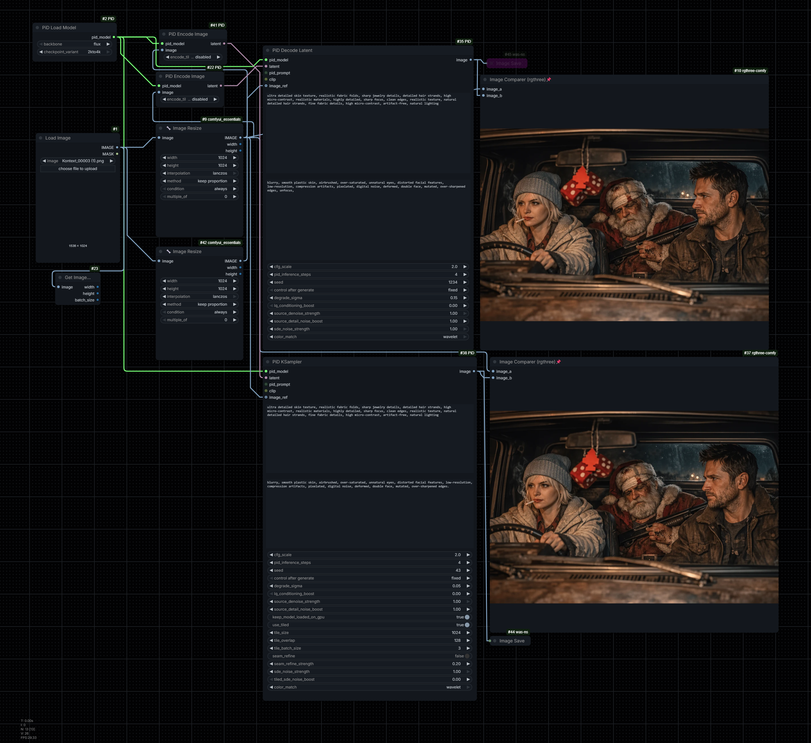

# ComfyUI PiD

Custom node for using `nvidia/PiD` in ComfyUI with the native PiD workflow, without relying on `PiD Conditioning` or the core `KSampler`.

## What This Package Does

- Loads the official PiD checkpoints for `flux`, `sd3`, and `flux2`.
- Supports prompt pre-encoding to reduce repeated text encoder cost, including optional external `CLIP` input with ComfyUI `pixeldit` format.
- Supports image encoding with PiD's own encoder to generate compatible latents.
- Keeps the runtime lazy so loading the node does not immediately force the full PiD network and text stack onto GPU.
- Uses a lighter VAE-only path for image encoding and an on-demand internal Gemma 2 loader when no external `CLIP` is connected.
- Decodes `LATENT -> IMAGE` in the standard flow or in tiles for larger resolutions.
- Shows CLI progress for `PiD KSampler` with steps, `it/s`, and ETA, while tiled preview updates progressively in the node.

## Included Nodes

- `PiD Load Model`
  - Selects `backbone` and `checkpoint_variant`.
  - Prepares the PiD checkpoint and VAE assets for the selected backbone.
  - The full runtime stays lazy and only loads when prompt encoding or decoding actually needs it.

- `PiD Encode Prompt`
  - Inputs: `PID_MODEL`, `prompt`.
  - Optional input: `CLIP`.
  - Accepts an external ComfyUI `CLIP` configured for `pixeldit`, avoiding the internal Gemma 2 download when provided.
  - Output: `PID_PROMPT`.

- `PiD Encode Image`
  - Inputs: `PID_MODEL`, `IMAGE`, `encode_tile_size`.
  - Uses only the PiD VAE path to produce a compatible latent.
  - Supports `disabled`, `512`, and `1024` tiled encode modes to reduce the encode memory spike on larger images.
  - Output: `LATENT`.

- `PiD Decode Latent`
  - Inputs: `PID_MODEL`, `LATENT`, `prompt`, `pid_inference_steps`, `seed`, `degrade_sigma`.
  - Optional input: `PID_PROMPT`.
  - Output: `IMAGE`.

- `PiD Decode Latent Tiled`
  - Inputs: `PID_MODEL`, `LATENT`, `tile_size`, `tile_overlap`, `tile_batch_size`, `prompt`, `pid_inference_steps`, `seed`, `degrade_sigma`.
  - Optional input: `PID_PROMPT`.
  - Output: `IMAGE`.

- `PiD KSampler`
  - Inputs: `PID_MODEL`, `LATENT`, `prompt`, `pid_inference_steps`, `seed`, `degrade_sigma`, `keep_model_loaded_on_gpu`, `use_tiled`, `tile_size`, `tile_overlap`, `tile_batch_size`.
  - Optional input: `PID_PROMPT`.
  - Shows step progress, `it/s`, and ETA in the CLI during generation.
  - In tiled mode, shows an incremental low-resolution preview during tile restoration and replaces it with the final blended composition when done.
  - Output: `IMAGE`.

## Recommended Flow

1. Load the model with `PiD Load Model`.
2. If you plan to reuse the same prompt, use `PiD Encode Prompt`.
3. Use a `LATENT` compatible with the selected backbone, or generate one with `PiD Encode Image`.
4. Decode with `PiD Decode Latent`, `PiD Decode Latent Tiled`, or `PiD KSampler`.

## Example

- Example workflow: [`workflow_pid_flux2_2kto4k_tiled.json`](./workflow_pid_flux2_2kto4k_tiled.json)
- Additional workflow example: [`FLUX2_ERNIE-PID.json`](./FLUX2_ERNIE-PID.json)
- Additional tiled workflow example: [`PID TILED WORFLOW.json`](./PID%20TILED%20WORFLOW.json)
- Example output image:



- Example comparison image showing input and model result:


## Installation

1. Place this folder inside `ComfyUI/custom_nodes/`.
2. Install the dependencies in the ComfyUI environment:

```bash
pip install -r requirements.txt
```

3. Restart ComfyUI.
4. When the PiD weights are downloaded automatically, they are stored inside this custom node folder under `upstream-pid/checkpoints/`.
5. In a typical ComfyUI installation, that means the files will be saved to:

```text
ComfyUI/custom_nodes/ComfyUI-PiD/upstream-pid/checkpoints/
```

## Supported Backbones

- `flux`
- `sd3`
- `flux2`

## Official Resources And Disclaimer

- Official model repository: [`nvidia/PiD` on Hugging Face](https://huggingface.co/nvidia/PiD)
- Official PiD source repository: [`nv-tlabs/PiD` on GitHub](https://github.com/nv-tlabs/PiD)
- The released PiD models are subject to NVIDIA's own model license and usage terms. Always review the official model card and license before downloading, using, sharing, or adapting any of the provided weights.
- This custom node is developed for personal use and experimentation in a controlled environment.
- Running this node, downloading the models, and using them on your own hardware is the sole responsibility of each user.
- Any use outside the applicable model license terms, usage restrictions, or deployment limitations is the sole responsibility of the user who chooses to do so.

## Important Notes

- The backbone selected in `PiD Load Model` must match the latent family.
- The current architecture stays on the stable PiD wrapper path for actual decode quality, while trimming unnecessary load/prefetch behavior around it.
- The first load downloads weights from the [`nvidia/PiD`](https://huggingface.co/nvidia/PiD) repository.
- Downloaded PiD checkpoint files are stored locally in `upstream-pid/checkpoints/` inside this custom node directory.
- `PiD Load Model` downloads the PiD checkpoint and VAE assets, but it does not pre-download the internal Gemma 2 text encoder anymore.
- The Gemma 2 weights now come from [`Comfy-Org/Lumina_Image_2.0_Repackaged`](https://huggingface.co/Comfy-Org/Lumina_Image_2.0_Repackaged/tree/main/split_files/text_encoders) using the `gemma_2_2b_fp16.safetensors` file instead of the older non-safetensors model path.
- The tokenizer file is cached locally together with the text encoder so the PiD runtime can load the native `pixeldit` CLIP format from disk on later runs.
- Downloaded internal Gemma 2 files are stored under `upstream-pid/checkpoints/text_encoders/gemma-2-2b-it/` inside this custom node directory.
- The internal Gemma 2 is only downloaded on demand when PiD needs to encode prompts without an external ComfyUI `CLIP`.
- If you connect an external ComfyUI `CLIP` loaded with `type = pixeldit`, PiD uses that `clip` input and does not need the internal Gemma 2 at prompt time.
- `PiD Encode Image` now uses a lighter VAE-only runtime instead of forcing the full PiD runtime for image encode.
- The automatic encode correction keeps the original proportions by using centered crop/pad instead of resizing the source image.
- `PiD Encode Image` includes optional tiled encode modes (`512` and `1024`) to reduce VRAM spikes during latent creation.
- Development and validation for this custom node were tested on an NVIDIA RTX 3090.
- The recommended minimum GPU memory for practical use is 16 GB of VRAM.
- Environments with 12 GB or 8 GB of VRAM were not tested, but they may still work depending on the workflow and settings used.
- This node uses CUDA. There is no practical CPU support in this wrapper.
- This package does not keep `conditioner`, core `KSampler`, or extra experimental nodes outside the main PiD flow.
- `upstream-pid` is a vendored minimal subset of NVIDIA PiD kept only for the runtime pieces this node uses, not the full original project.
- `PiD Decode Latent Tiled` and `PiD KSampler` use `tile_batch_size` to process multiple same-sized tiles per call and reduce overhead.
- `PiD KSampler` includes `keep_model_loaded_on_gpu` so you can decide whether the PiD network stays resident on GPU after sampling.
- `PiD KSampler` now prints CLI progress with `current/total`, percent, `it/s`, and ETA.
- Tiled preview stays in the preview size configured by ComfyUI, updates incrementally during restoration, and publishes a final blended preview at the end.
- The decode node shows only `height x width` in a compact read-only `resolution` field below the preview, without creating extra graph outputs.
- Small tiles such as `256` are decoded with extra internal context before the final crop to reduce green tint and color collapse.
- Green artifacts can also appear in non-tiled decoding when aspect-ratio changes or custom resolutions push the latent outside the model's most stable size/alignment range. This is not limited to `4:3`; the bigger issue is usually latent/grid alignment and using a checkpoint variant outside the resolution range where it is most stable.
- As a practical rule, `2k` is usually the safer choice around a `512` base workflow, while `2kto4k` is usually the safer choice around a `1024` base workflow.
- Using the `2k` checkpoint variant with `1024` in direct non-tiled decoding can still be accepted by the model, but it is more likely to produce green artifacts, color collapse, or unstable results than the same workflow at `512`.
- Tiled decoding is often more stable at larger resolutions because the model processes smaller local regions instead of one large full-frame decode, so `1024` and larger outputs tend to behave better in tiled mode than in direct mode.
- For best stability, prefer generating or encoding directly at the target aspect ratio and keep dimensions aligned to the backbone: multiples of `32` are safer for `flux` and `sd3`, and multiples of `64` are safer for `flux2`.
- For `flux2`, the encode path is especially strict because the VAE uses an effective `16x` spatial compression and an internal `2x2` patchification step, so dimensions that drift away from the safe multiples are more likely to fail or produce unstable colors.
- The `nvidia/PiD` model has its own NVIDIA usage terms. Check the model card license before distributing or using it in production.

## Local Validation

The unit tests in this repository validate:

- ComfyUI node contracts;
- `LATENT` to `IMAGE` conversion;
- channel validation per backbone;
- image encoding and prompt cache behavior;
- correct runtime delegation with mocks.

Run:

```bash
python -m unittest discover -s tests -v
```
